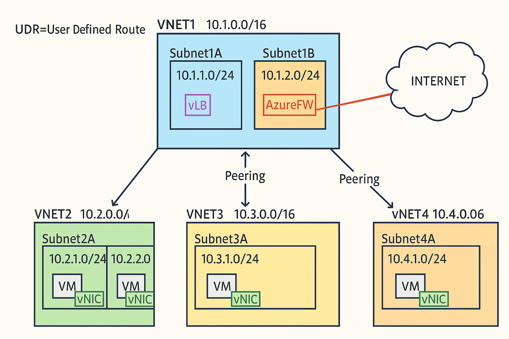

*Day 4 – Azure Networking Basics**

“Azure Networking Basics in 20 Minutes – VNet, Subnet, NSG, and Peering Explained”

**INTRO 

“Hey everyone! Welcome back to Day 4 of our *Azure Zero to Hero* series.
Today, we’re diving into one of the most important topics in cloud — **Azure Networking**.

Have you ever wondered how your Virtual Machine connects to the internet or talks to other services securely?
Well, that’s all about **VNets, Subnets, NSGs, and Peering** — and by the end of this video, you’ll be confident about how Azure networking really works.”

---

What is a VNet? (1:00 - 4:00)**

🗨️ “A **Virtual Network (VNet)** in Azure is like your private data center inside the cloud.
Think of it as a **fenced network** where all your resources — like VMs, databases, or web apps — live securely.”

🎨 **Whiteboard / Slide Explanation:**

```
Azure VNet = Cloud version of your on-prem network
VNet → Subnets → Resources (VMs, DBs)
```

🧩 **Example:**

* Create a Virtual Network named `vnet-demo`
* Address space: `10.0.0.0/16`
* This range gives you 65,536 IPs to divide into smaller subnets.

💡 **Tip:** You can have multiple VNets in one region or across regions.

---

 Subnets 

🗨️ “A subnet is like dividing your big house (VNet) into rooms — each room for a purpose.”

🧩 **Example:**

* Inside `vnet-demo`, create:

  * `frontend-subnet` → 10.0.1.0/24
  * `backend-subnet` → 10.0.2.0/24

💬 “Frontend VMs might handle web traffic, and backend VMs might handle databases.
This separation improves security and organization.”

---
 Network Security Groups (NSG)

🗨️ “Now that we’ve got our networks, let’s secure them.
That’s where **Network Security Groups (NSGs)** come in.
An NSG is basically a firewall for your subnets or individual VMs.”

🎯 **NSG Rules:**

* Each rule has:

  * **Priority** (lower = processed first)
  * **Source/Destination**
  * **Port**
  * **Protocol**
  * **Allow or Deny**

🧩 **Example Demo:**

1. Create NSG → `frontend-nsg`
2. Add inbound rule:

   * Allow TCP 80 (HTTP) from Any → Any
   * Priority: 100
3. Add inbound rule:

   * Allow TCP 22 (SSH) from your IP → Any
   * Priority: 200

Then associate NSG with the **frontend-subnet**.

💬 “Now only HTTP and SSH traffic are allowed — everything else is denied by default!”

---

VNet Peering 
🗨️ “What if you have two VNets — one in East US and another in West Europe — and you want them to talk securely without going over the public internet?
That’s where **VNet Peering** comes in.”

🎨 **Diagram:**

```
VNet1 (10.0.0.0/16)  ↔  VNet2 (10.1.0.0/16)
     Peering Connection
```

🧩 **Example:**

* Create `vnet-east` (10.0.0.0/16)
* Create `vnet-west` (10.1.0.0/16)
* Go to `vnet-east` → Peerings → Add → connect to `vnet-west`

💬 “Once peered, they act like one network.
VMs in each VNet can ping each other using private IPs.”

---

Demo: VM Connectivity Test

1. Create 2 VMs:

   * `frontend-vm` in `frontend-subnet`
   * `backend-vm` in `backend-subnet`
2. SSH into frontend-vm:

   ```bash
   ping 10.0.2.4
   ```

   (IP of backend-vm)
3. If NSG allows, ping works — you’ve successfully connected via Azure network!

---

🗨️ “Let’s quickly recap what we learned today:

* **VNet**: Your private network in Azure
* **Subnets**: Logical divisions of the VNet
* **NSG**: Security rules to control traffic
* **Peering**: Connects VNets together privately

These are the foundation for everything else in Azure — including hybrid setups, VPNs, and service endpoints.”

---


“Great job completing Day 4 of the Azure Zero to Hero series!
In the next video, we’ll explore **Azure Storage** — where your data actually lives in the cloud.


---

## 🧰 **Optional Commands for Demo**

```bash
# Create a resource group
az group create --name demo-rg --location uksouth

# Create VNet and subnets
az network vnet create --resource-group demo-rg --name vnet-demo --address-prefix 10.0.0.0/16 \
  --subnet-name frontend-subnet --subnet-prefix 10.0.1.0/24

az network vnet subnet create --resource-group demo-rg --vnet-name vnet-demo \
  --name backend-subnet --address-prefix 10.0.2.0/24

# Create NSG and rules
az network nsg create --resource-group demo-rg --name frontend-nsg
az network nsg rule create --resource-group demo-rg --nsg-name frontend-nsg \
  --name allow-http --protocol tcp --direction inbound --priority 100 --source-address-prefixes '*' \
  --source-port-ranges '*' --destination-port-ranges 80 --access allow

# Associate NSG with subnet
az network vnet subnet update --vnet-name vnet-demo --name frontend-subnet \
  --resource-group demo-rg --network-security-group frontend-nsg
```

--

