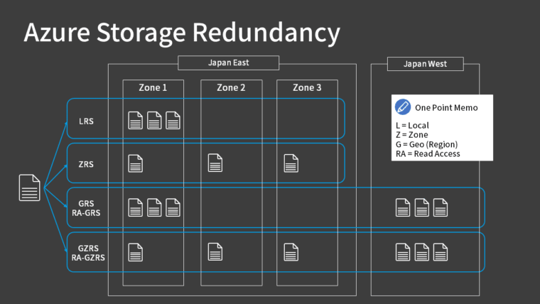

## 💡 1. What is Azure Storage?

**Azure Storage** is Microsoft’s cloud-based storage solution that provides scalable, secure, durable, and highly available storage for your data.
You can store everything — from files and images to logs, videos, databases, and virtual hard disks.

### 🔹 Key Benefits:

* **Scalable:** Grows automatically with your data needs.
* **Durable:** Your data is replicated to protect against hardware failures.
* **Secure:** Encrypted at rest and in transit.
* **Accessible:** Can be accessed via REST APIs, SDKs, CLI, or portal.
* **Cost-effective:** Pay for what you use, with various pricing tiers.

---

## 🧱 2. Storage Services Overview

Azure Storage is not just one service — it’s a **suite of services** for different data types.

| Storage Type      | Description                                                                  | Example Use Case                             |
| ----------------- | ---------------------------------------------------------------------------- | -------------------------------------------- |
| **Blob Storage**  | Object storage for unstructured data like images, videos, documents, backups | Store app logs, website images, data lake    |
| **File Storage**  | Fully managed file shares accessible via SMB/NFS                             | Lift-and-shift on-prem file servers to cloud |
| **Queue Storage** | Messaging store for asynchronous communication between components            | Decoupling background tasks in microservices |
| **Table Storage** | NoSQL key-attribute store for structured data                                | Store metadata, configuration, IoT data      |
| **Disk Storage**  | Persistent disks for Azure VMs                                               | OS disk, Data disk for VMs                   |

---

## 🧩 3. Blob Storage – “Object Storage”

**Blob (Binary Large Object) Storage** is designed for storing **massive amounts of unstructured data** — text or binary data.
It’s like a **data lake** or a **container for files**.

### 🔸 Types of Blobs:

| Type            | Description                                                     | Example                      |
| --------------- | --------------------------------------------------------------- | ---------------------------- |
| **Block Blob**  | Stores text/binary data in blocks. Great for uploads/downloads. | Images, videos, documents    |
| **Append Blob** | Optimized for append operations (adding data at end).           | Logging, streaming data      |
| **Page Blob**   | Used for frequent random read/write operations.                 | Virtual machine disks (VHDs) |

### 🔸 Structure Example:

```
Storage Account
   └── Container (like a folder)
         └── Blob (the actual file)
```

Example:
`https://myazurestorage.blob.core.windows.net/images/profile.jpg`

---

## ⚙️ 4. Access Tiers (for Blobs)

Azure Blob Storage offers **different access tiers** to optimize cost based on how often data is accessed.

| Tier        | Description                                      | Use Case                                  |
| ----------- | ------------------------------------------------ | ----------------------------------------- |
| **Hot**     | Frequently accessed data                         | Active app data, website content          |
| **Cool**    | Infrequently accessed data (available instantly) | Backups, short-term archival              |
| **Archive** | Rarely accessed data (retrieval takes hours)     | Compliance data, logs older than 6 months |

### 💰 Example:

* Hot: £0.018 per GB/month (higher cost for storage)
* Cool: £0.01 per GB/month (cheaper storage, higher retrieval)
* Archive: £0.002 per GB/month (cheapest storage, slowest retrieval)

---

## 🧮 5. Redundancy & Replication Options

Azure ensures **high durability and availability** by replicating your data.

### 🔸 Local Redundant Storage (LRS)

* Data is replicated **3 times** within a single data center.
* Cheapest option.
* Protects against hardware failure **only**.
* ❌ Not protected against data center outage.

📘 Example: If one disk fails, two more copies exist in the same region.

---

### 🔸 Zone Redundant Storage (ZRS)

* Replicates data **across 3 different Availability Zones** in a region.
* Protects against **data center** failures.
* ✅ High availability for production workloads.

📘 Example: If a zone in UK South fails, your data is still available from another zone.

---

### 🔸 Geo-Redundant Storage (GRS)

* Replicates data **across two regions** (primary + secondary hundreds of miles apart).
* **Primary region:** Read/write
* **Secondary region:** For disaster recovery only.

📘 Example: UK South → replicated to UK West region automatically.

---

### 🔸 Read-Access Geo-Redundant Storage (RA-GRS)

* Same as GRS, but allows **read access** to secondary region.
* Useful for **disaster recovery and high availability**.

📘 Example: If UK South is down, you can still read from UK West instantly.

---

### 💡 Quick Comparison:

| Option     | Copies | Region(s)      | Availability | Best For        |
| ---------- | ------ | -------------- | ------------ | --------------- |
| **LRS**    | 3      | 1              | 99.9%        | Dev/Test        |
| **ZRS**    | 3      | 1 (multi-zone) | 99.99%       | Production data |
| **GRS**    | 6      | 2              | 99.9%        | Backup, DR      |
| **RA-GRS** | 6      | 2 (readable)   | 99.99%       | Global apps     |

---

### 🧠 Real-World Example

Let’s say your app stores **user profile pictures** in Blob Storage:

* Use **Hot Tier** for recent uploads.
* Use **Cool Tier** for inactive users.
* Store data in **ZRS** to survive data center failure.
* Keep backups in **GRS** for disaster recovery.

---

## ✅ Summary

| Concept           | Description                          | Example                       |
| ----------------- | ------------------------------------ | ----------------------------- |
| **Azure Storage** | Scalable, durable cloud storage      | Store app data, logs, backups |
| **Blob Storage**  | Object storage for unstructured data | Images, videos                |
| **Access Tiers**  | Hot, Cool, Archive                   | Save cost by usage pattern    |
| **Redundancy**    | LRS, ZRS, GRS, RA-GRS                | Keeps data safe and available |

---
✅ Choose replication (LRS/GRS) based on business continuity needs.
✅ Secure access — prefer Azure AD & SAS over account keys.
✅ Use lifecycle rules to optimize cost.
✅ Monitor storage metrics & set alerts.
✅ Enable soft delete/versioning.
✅ Organize naming patterns to avoid hotspots.
✅ Avoid public access unless required.
✅ Use Private Endpoint to isolate traffic.

===========================================================
Soft Delete, Versioning & Immutable Blobs
Feature	Purpose	Example
Soft Delete-Recover deleted blobs-If someone deletes a file, restore within retention period
Versioning-Keep old versions-Track changes to config.json
Immutable Policy-Prevent changes-Store financial records for 7 years

==========================================================


Perfect — here’s a clear, **YouTube-ready explanation** of **Soft Delete, Versioning, and Immutable Blobs** in **Azure Blob Storage** — simplified for narration, with examples and flow 👇

---

🎥 **🎯 Topic: Soft Delete, Versioning & Immutable Blobs – Azure Blob Storage**

---

### 🧩 **1️⃣ Soft Delete**

**What it is:**
Soft Delete protects your data from accidental deletion.
When someone deletes a blob, it’s not gone immediately — Azure just marks it as “soft deleted.”

**How it helps:**
You can restore the blob anytime within the *retention period* you’ve set (like 7 or 30 days).

**Example:**
Imagine someone accidentally deletes a project file — say *report.pdf*.
With Soft Delete enabled, you can simply **recover that file** from the deleted items — no data loss, no panic.

🗓️ *Think of it like a Recycle Bin for Azure Blobs.*

---

### 🧩 **2️⃣ Versioning**

**What it is:**
Blob Versioning automatically keeps previous versions every time a blob is modified or overwritten.
Each version is stored separately, and you can roll back to any version when needed.

**How it helps:**
You’ll never lose an older configuration, file, or dataset due to accidental overwrites.

**Example:**
Let’s say you have a file called *config.json* that stores app settings.
Every time you update this file, Azure saves the older copy as a new version.
If something breaks after a change, you can easily restore a **previous version**.

🗂️ *Versioning = Time Machine for your blobs.*

---

### 🧩 **3️⃣ Immutable Blobs (Write Once, Read Many - WORM)**

**What it is:**
Immutable Blob Storage lets you **lock data** so that it cannot be modified or deleted for a defined period.
Even administrators can’t overwrite it once it’s locked.

**How it helps:**
It’s perfect for **compliance, audits, and legal requirements** — where data must stay unchanged.

**Example:**
Suppose you store financial records or tax data that must be kept unchanged for **7 years**.
You can set an **immutable policy**, and Azure will block any modifications until that period ends.

🔒 *Immutable = Once written, cannot be altered.*

---

### ✅ **Quick Recap Table**

| Feature              | Purpose                            | Example                                    |
| -------------------- | ---------------------------------- | ------------------------------------------ |
| **Soft Delete**      | Recover accidentally deleted blobs | Restore a deleted *report.pdf*             |
| **Versioning**       | Keep old versions of a blob        | Revert *config.json* to an earlier version |
| **Immutable Policy** | Prevent any changes or deletions   | Lock financial data for 7 years            |

---


> “So remember — **Soft Delete** saves you from accidental deletions, **Versioning** protects you from bad updates, and **Immutable Blobs** ensure your data stays tamper-proof for compliance. Three simple features — massive data protection!”

